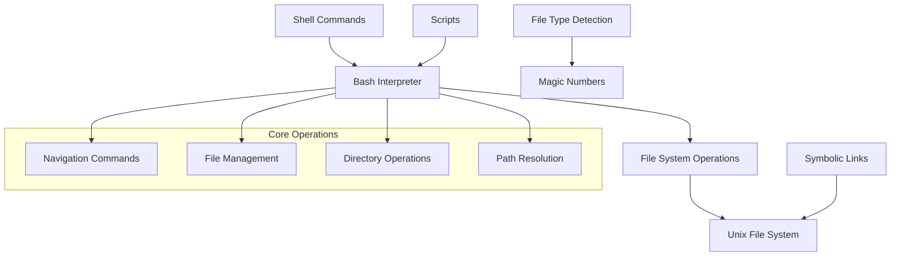
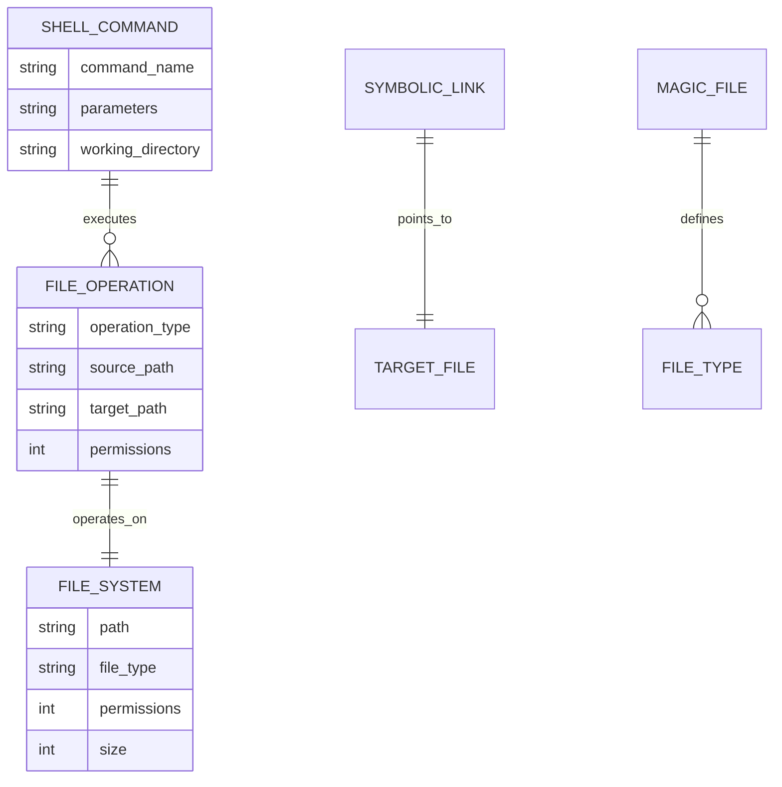
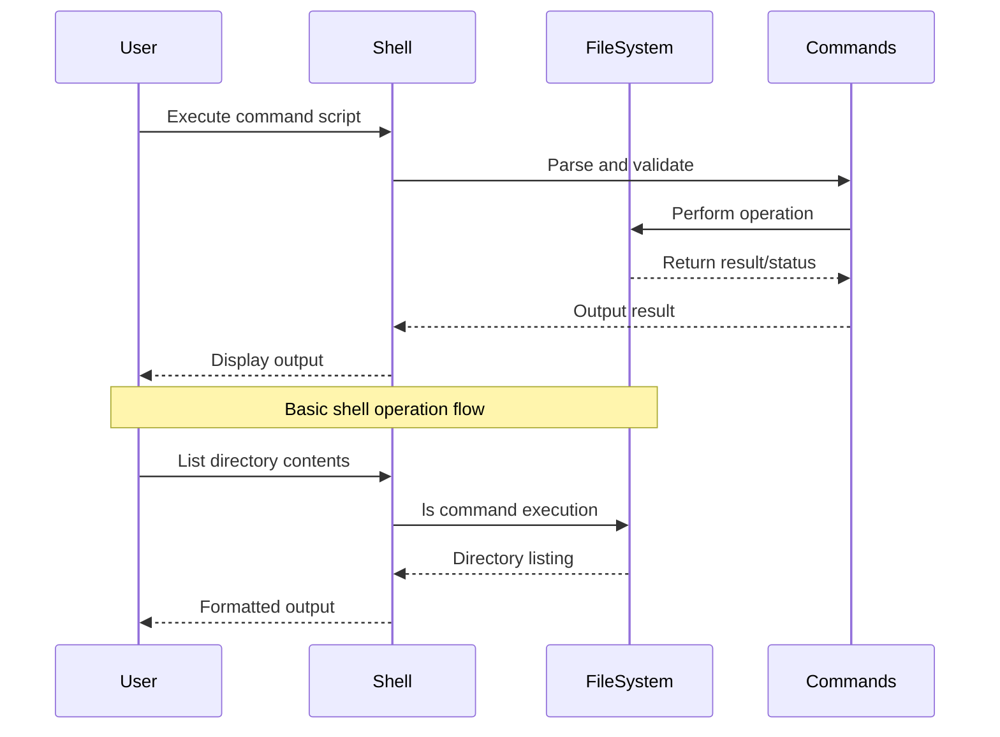

# 🏗️ System Architecture

## 📖 Overview
This container introduces fundamental Unix/Linux shell navigation, file manipulation, and basic command-line operations. It demonstrates essential shell commands for file system navigation, directory management, file operations, and understanding of Unix file system concepts including file types, permissions, and path structures.

---

## 🏛️ High-Level Architecture

The architecture demonstrates basic shell command execution flow with file system interaction and Unix-specific operations.

---

## 🧩 Core Components

### Shell Command Layer
- **Purpose**: Implements basic Unix/Linux command operations
- **Technology**: Bash shell scripting
- **Location**: Script files without extensions
- **Responsibilities**:
  - Directory navigation (`pwd`, `cd`, `ls`)
  - File operations (`cp`, `mv`, `rm`)
  - Path manipulation and resolution
  - File type identification
- **Interfaces**: Command-line execution, shell interpreter

### File System Interface
- **Purpose**: Provides direct interaction with Unix file system
- **Technology**: Unix file system commands
- **Location**: Various command scripts
- **Responsibilities**:
  - File and directory creation/deletion
  - Symbolic link management
  - File attribute inspection
  - Path traversal operations
- **Interfaces**: Unix file system, shell environment

### Magic File System
- **Purpose**: Demonstrates file type detection using magic numbers
- **Technology**: Unix `file` command integration
- **Location**: `school.mgc`
- **Responsibilities**:
  - Custom file type definition
  - Magic number pattern matching
  - File classification enhancement
- **Interfaces**: Unix file command, custom magic database

---

## 📊 Data Models & Schema

### Key Data Entities
- **Shell Commands**: Individual executable scripts demonstrating specific operations
- **File Operations**: CRUD operations on files and directories
- **Path Structures**: Absolute and relative path representations
- **File Metadata**: Permissions, types, and attributes

### Relationships
- Commands → File System: Direct manipulation relationship
- Symbolic Links → Files: Reference relationship through file system
- Magic Files → File Types: Pattern matching for classification

---

## 🔄 Data Flow & Interactions

### Interaction Patterns
- **Command Execution**: User input → Shell parsing → File system operation → Result output
- **Path Resolution**: Relative paths converted to absolute paths through working directory context
- **File Operations**: Source/target validation → Operation execution → Status feedback

---

## 🔒 Security & Permissions

### File System Security
- **Permission Model**: Unix rwx permission system for user/group/other
- **Path Validation**: Prevents unauthorized directory traversal
- **Command Isolation**: Each script operates in controlled environment

### Best Practices
- Minimal privilege principle for file operations
- Input validation for path parameters
- Safe file handling practices

---

## ⚡ Performance Considerations

### Optimization Strategies
- **Command Efficiency**: Use of built-in shell commands over external utilities
- **Path Caching**: Working directory context maintained across operations
- **Batch Operations**: Multiple file operations combined where possible

### Resource Management
- Minimal memory footprint for basic operations
- Efficient file system traversal patterns
- Optimized command parameter parsing

---

## 🧪 Testing Strategy

### Test Categories
- **Functional Tests**: Each command script validates expected behavior
- **Path Resolution Tests**: Absolute vs relative path handling
- **File Operation Tests**: Create, read, update, delete operations
- **Permission Tests**: File system permission validation

### Validation Approach
- Script execution with expected output verification
- File system state validation after operations
- Error handling for invalid operations

---

## 📈 Scalability & Extensibility

### Design Patterns
- **Modular Commands**: Each operation as independent script
- **Composable Operations**: Commands can be chained and combined
- **Extension Points**: Custom magic file definitions, additional file types

### Future Enhancements
- Advanced file filtering and search capabilities
- Batch operation scripting
- Enhanced file metadata handling

---

## 🔧 Configuration & Setup

### Prerequisites
- Unix/Linux operating system
- Bash shell environment
- Standard Unix utilities (`ls`, `cd`, `pwd`, etc.)

### Environment Setup
- Working directory: Container root
- Shell environment: Bash with standard PATH
- File permissions: Executable scripts, readable data files

---

## 📚 Dependencies & Integration

### System Dependencies
- Bash shell (version 4.0+)
- Unix core utilities
- File system with standard Unix permissions

### Integration Points
- Shell environment integration
- File system API compatibility
- Standard input/output streams

---

## 🏷️ Metadata

- **Container**: 0x00-shell_basics
- **Category**: System Engineering & DevOps
- **Complexity**: Beginner
- **Prerequisites**: Basic Unix/Linux knowledge
- **Learning Path**: Foundation for advanced shell scripting and system administration
