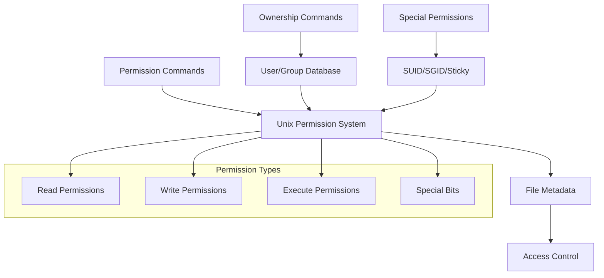
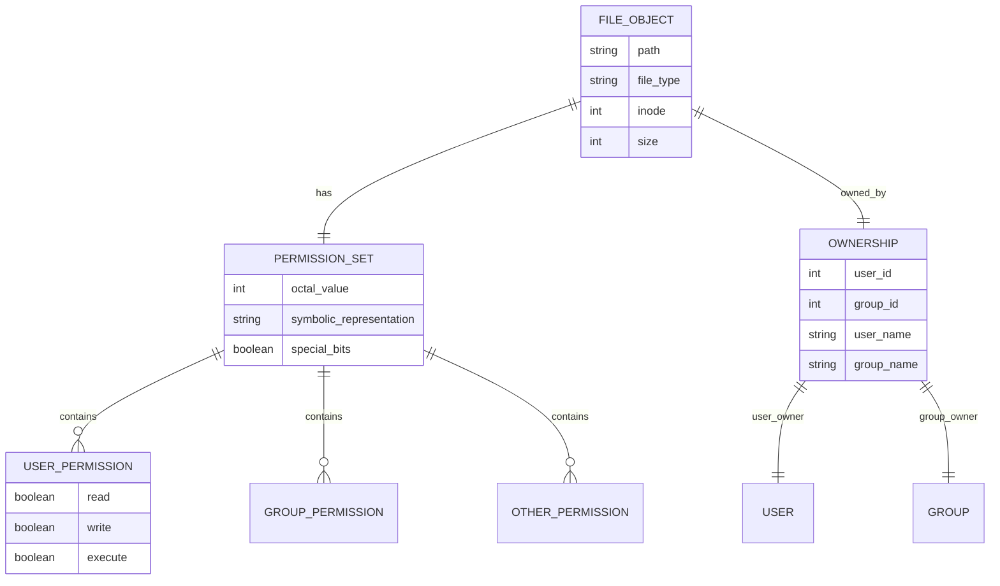
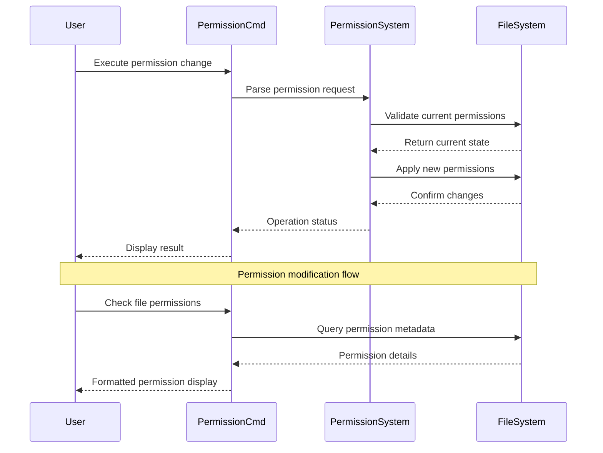

# 🏗️ System Architecture

## 📖 Overview
This container focuses on Unix/Linux file permissions and ownership management. It demonstrates the comprehensive permission system including read, write, execute permissions for user, group, and others, along with special permissions, ownership changes, and security models that form the foundation of Unix system security.

---

## 🏛️ High-Level Architecture

The architecture demonstrates Unix permission model with comprehensive access control and ownership management.

---

## 🧩 Core Components

### Permission Management Layer
- **Purpose**: Implements Unix file permission operations
- **Technology**: Unix permission system, chmod/chown commands
- **Location**: Permission manipulation scripts
- **Responsibilities**:
  - Numeric and symbolic permission setting
  - Permission reading and interpretation
  - Access control validation
  - Permission inheritance handling
- **Interfaces**: File system permissions, Unix access control

### Ownership Management System
- **Purpose**: Controls file and directory ownership
- **Technology**: Unix user/group system
- **Location**: Ownership change scripts
- **Responsibilities**:
  - User ownership assignment
  - Group ownership management
  - Ownership inheritance control
  - Permission delegation
- **Interfaces**: User database, group database, file system

### Special Permissions Handler
- **Purpose**: Manages advanced Unix permission features
- **Technology**: SUID, SGID, sticky bit mechanisms
- **Location**: Special permission scripts
- **Responsibilities**:
  - Set-user-ID (SUID) configuration
  - Set-group-ID (SGID) management
  - Sticky bit implementation
  - Enhanced security controls
- **Interfaces**: Extended permission system, security subsystem

---

## 📊 Data Models & Schema

### Key Data Entities
- **File Objects**: Files and directories with associated metadata
- **Permission Sets**: Complete permission configurations (rwx for user/group/other)
- **Ownership Records**: User and group ownership information
- **Special Permissions**: Advanced permission bits (SUID, SGID, sticky)

### Relationships
- Files → Permissions: One-to-one relationship with permission sets
- Files → Ownership: Direct ownership through user/group assignment
- Permissions → Access Control: Enforcement through system calls

---

## 🔄 Data Flow & Interactions

### Interaction Patterns
- **Permission Query**: Read current permission state from file system metadata
- **Permission Modification**: Atomic updates to permission bits with validation
- **Ownership Changes**: User/group assignment with privilege verification
- **Access Validation**: Real-time permission checking during file operations

---

## 🔒 Security & Permissions

### Access Control Model
- **Discretionary Access Control (DAC)**: Owner-controlled permission assignment
- **Permission Inheritance**: Directory permissions affecting contained objects
- **Privilege Escalation**: SUID/SGID for controlled privilege elevation

### Security Features
- **Principle of Least Privilege**: Minimal required permissions for operations
- **Permission Validation**: Continuous access control enforcement
- **Audit Trails**: Permission change logging and tracking

### Best Practices
- Regular permission audits and validation
- Minimal use of special permissions (SUID/SGID)
- Group-based access control for collaborative environments

---

## ⚡ Performance Considerations

### Optimization Strategies
- **Cached Permission Lookups**: File system caching of permission metadata
- **Batch Operations**: Multiple permission changes in single operations
- **Efficient Permission Parsing**: Optimized octal/symbolic conversion

### Resource Management
- Minimal system call overhead for permission operations
- Efficient metadata storage and retrieval
- Optimized permission inheritance algorithms

---

## 🧪 Testing Strategy

### Test Categories
- **Permission Setting Tests**: Validation of numeric and symbolic permission changes
- **Ownership Tests**: User and group ownership assignment verification
- **Special Permission Tests**: SUID, SGID, sticky bit functionality
- **Access Control Tests**: Permission enforcement validation

### Validation Approach
- Before/after permission state comparison
- Access attempt validation with different user contexts
- Special permission behavior verification

---

## 📈 Scalability & Extensibility

### Design Patterns
- **Modular Permission Operations**: Independent permission modification scripts
- **Extensible Permission Models**: Support for additional permission schemes
- **Composable Operations**: Chainable permission and ownership commands

### Future Enhancements
- Advanced ACL (Access Control List) support
- Role-based permission management
- Automated permission policy enforcement

---

## 🔧 Configuration & Setup

### Prerequisites
- Unix/Linux operating system with standard permission system
- User account with appropriate privileges for ownership changes
- Understanding of Unix permission concepts

### Environment Setup
- Working directory: Container root with various permission test files
- User context: Standard user with sudo access where required
- File system: Unix-compatible with full permission support

---

## 📚 Dependencies & Integration

### System Dependencies
- Unix permission system (chmod, chown, chgrp commands)
- User and group management system
- File system with extended attribute support

### Integration Points
- System user database integration
- File system permission enforcement
- Security subsystem interaction

---

## 🏷️ Metadata

- **Container**: 0x01-shell_permissions
- **Category**: System Engineering & DevOps
- **Complexity**: Intermediate
- **Prerequisites**: Basic shell knowledge, understanding of user/group concepts
- **Learning Path**: Foundation for system administration and security
