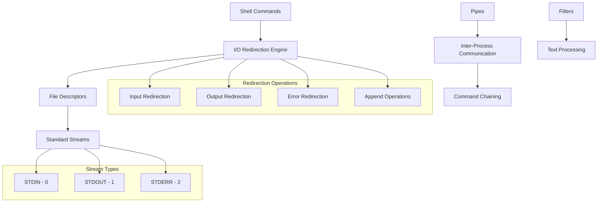
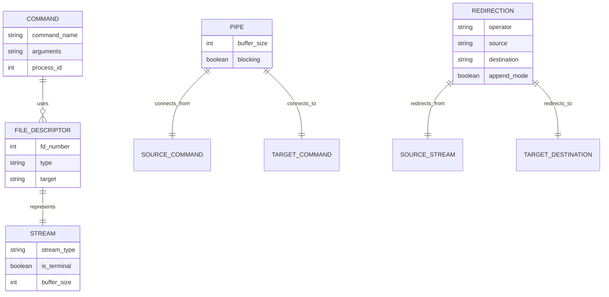
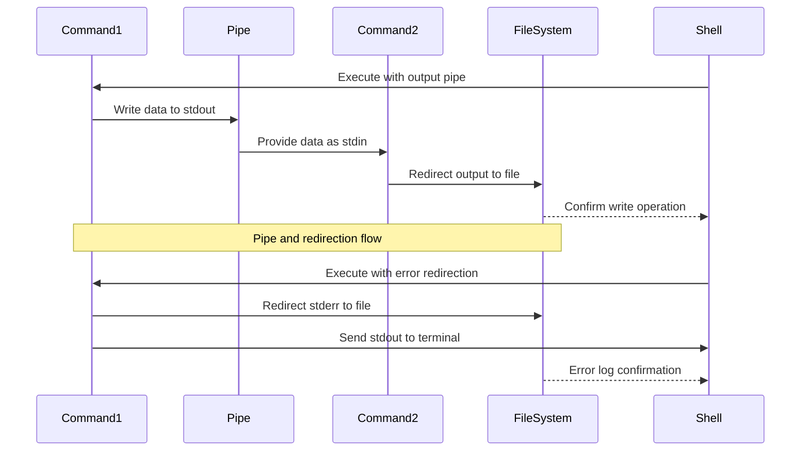

# 🏗️ System Architecture

## 📖 Overview
This container explores Unix/Linux shell input/output redirection and piping mechanisms. It demonstrates stream manipulation, file descriptor management, command chaining through pipes, and advanced I/O operations that form the foundation of Unix philosophy: combining simple tools to accomplish complex tasks.

---

## 🏛️ High-Level Architecture

The architecture demonstrates Unix stream redirection with comprehensive I/O manipulation and command composition capabilities.

---

## 🧩 Core Components

### I/O Redirection System
- **Purpose**: Manages input/output stream redirection
- **Technology**: Shell redirection operators (<, >, >>, 2>, &>, etc.)
- **Location**: Various redirection scripts
- **Responsibilities**:
  - Standard stream redirection (stdin, stdout, stderr)
  - File descriptor manipulation
  - Stream combining and separation
  - Append vs overwrite operations
- **Interfaces**: Shell environment, file system, process streams

### Pipe Communication Layer
- **Purpose**: Enables command composition through pipes
- **Technology**: Unix pipe mechanism (|)
- **Location**: Pipe-based command scripts
- **Responsibilities**:
  - Inter-process communication
  - Stream buffering and flow control
  - Command chain orchestration
  - Data transformation pipelines
- **Interfaces**: Process management, stream handling, command execution

### Text Processing Filters
- **Purpose**: Implements common text manipulation operations
- **Technology**: Unix text utilities (grep, cut, sort, tr, etc.)
- **Location**: Filter and processing scripts
- **Responsibilities**:
  - Pattern matching and extraction
  - Text transformation and formatting
  - Data sorting and organization
  - Character and string manipulation
- **Interfaces**: Text streams, regular expressions, locale system

---

## 📊 Data Models & Schema

### Key Data Entities
- **Commands**: Individual executable components in command chains
- **File Descriptors**: System-level stream identifiers (0, 1, 2, etc.)
- **Streams**: Data flow channels (stdin, stdout, stderr)
- **Pipes**: Communication channels between processes
- **Redirections**: Stream routing configurations

### Relationships
- Commands → File Descriptors: Process-level stream association
- Pipes → Commands: Inter-process communication linkage
- Redirections → Streams: Stream routing and destination mapping

---

## 🔄 Data Flow & Interactions

### Interaction Patterns
- **Simple Redirection**: Command output → File destination
- **Pipe Chains**: Command1 stdout → Command2 stdin → Command3 stdin → Final output
- **Error Handling**: Separate stderr processing while maintaining stdout flow
- **Bidirectional Operations**: Input from file + Output to different file

---

## 🔒 Security & Permissions

### Stream Security
- **File Permission Validation**: Redirection target permission checking
- **Process Isolation**: Pipe communication within security boundaries
- **Resource Limits**: Buffer size and file descriptor limits

### Best Practices
- Validation of redirection targets before execution
- Proper error stream handling to prevent information leakage
- Resource cleanup for pipe and file descriptor management

---

## ⚡ Performance Considerations

### Optimization Strategies
- **Stream Buffering**: Efficient buffer management for pipes and redirections
- **Lazy Evaluation**: On-demand stream processing
- **Memory Management**: Minimal memory footprint for stream operations

### Resource Management
- File descriptor lifecycle management
- Pipe buffer optimization
- Efficient command chain execution

---

## 🧪 Testing Strategy

### Test Categories
- **Redirection Tests**: Input/output/error stream redirection validation
- **Pipe Tests**: Command chaining and data flow verification
- **Filter Tests**: Text processing and transformation accuracy
- **Error Handling Tests**: Stream error propagation and handling

### Validation Approach
- Output comparison with expected results
- Stream separation verification (stdout vs stderr)
- Pipe data integrity checking
- Performance benchmarking for complex chains

---

## 📈 Scalability & Extensibility

### Design Patterns
- **Composable Filters**: Chainable text processing operations
- **Modular Redirections**: Independent stream routing operations
- **Extensible Pipelines**: Support for custom command chains

### Future Enhancements
- Advanced stream multiplexing
- Parallel pipe processing
- Custom filter development framework

---

## 🔧 Configuration & Setup

### Prerequisites
- Unix/Linux operating system with full shell capabilities
- Standard Unix text utilities (grep, cut, sort, tr, etc.)
- Understanding of Unix process and stream concepts

### Environment Setup
- Working directory: Container root with test files and data
- Shell environment: Bash with full redirection support
- File system: Read/write access for redirection operations

---

## 📚 Dependencies & Integration

### System Dependencies
- Bash shell with full I/O redirection support
- Unix process management system
- Standard Unix text processing utilities

### Integration Points
- Shell environment integration
- File system I/O operations
- Process management system interaction

---

## 🏷️ Metadata

- **Container**: 0x02-shell_redirections
- **Category**: System Engineering & DevOps
- **Complexity**: Intermediate
- **Prerequisites**: Basic shell knowledge, understanding of Unix processes
- **Learning Path**: Essential for advanced shell scripting and system automation
