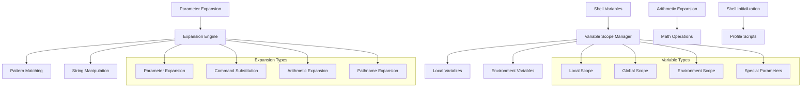
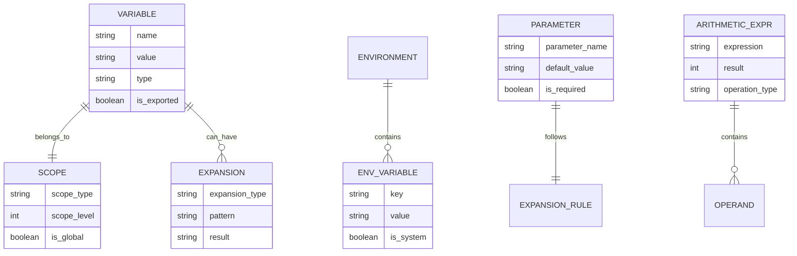
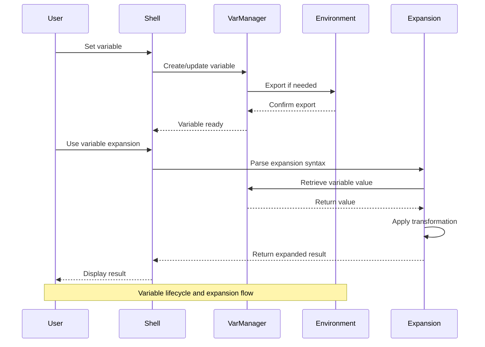

# 🏗️ System Architecture

## 📖 Overview
This container focuses on Unix/Linux shell variable management, environment configuration, and expansion mechanisms. It demonstrates variable scoping, environment variable management, parameter expansion, arithmetic operations, and shell initialization processes that enable dynamic and configurable shell environments.

---

## 🏛️ High-Level Architecture

The architecture demonstrates comprehensive shell variable and expansion system with scope management and dynamic evaluation capabilities.

---

## 🧩 Core Components

### Variable Management System
- **Purpose**: Handles variable creation, modification, and scope control
- **Technology**: Shell variable mechanisms (local, export, unset)
- **Location**: Variable manipulation scripts
- **Responsibilities**:
  - Variable assignment and retrieval
  - Scope management (local vs environment)
  - Variable lifecycle control
  - Type and value validation
- **Interfaces**: Shell environment, process environment, variable namespace

### Parameter Expansion Engine
- **Purpose**: Implements advanced variable expansion and manipulation
- **Technology**: Shell parameter expansion syntax (${}, $(), etc.)
- **Location**: Expansion demonstration scripts
- **Responsibilities**:
  - Variable substitution and expansion
  - Default value assignment
  - String manipulation operations
  - Pattern matching and replacement
- **Interfaces**: Variable storage, pattern matching, string processing

### Environment Configuration Layer
- **Purpose**: Manages shell environment setup and initialization
- **Technology**: Shell profile and initialization scripts
- **Location**: Initialization and configuration scripts
- **Responsibilities**:
  - Environment variable configuration
  - PATH and system variable setup
  - Shell option configuration
  - User environment customization
- **Interfaces**: System environment, user profiles, shell configuration

### Arithmetic Processing Unit
- **Purpose**: Handles mathematical operations and numeric processing
- **Technology**: Shell arithmetic expansion $(( ))
- **Location**: Arithmetic operation scripts
- **Responsibilities**:
  - Integer arithmetic operations
  - Variable-based calculations
  - Conditional numeric evaluation
  - Mathematical expression parsing
- **Interfaces**: Numeric variables, mathematical operators, expression parser

---

## 📊 Data Models & Schema

### Key Data Entities
- **Variables**: Named storage containers with scope and type information
- **Scopes**: Variable visibility and lifecycle contexts (local, global, environment)
- **Expansions**: Dynamic variable evaluation and transformation rules
- **Environment Variables**: System-wide configuration parameters
- **Parameters**: Command-line and function arguments
- **Arithmetic Expressions**: Mathematical operations and calculations

### Relationships
- Variables → Scopes: Ownership and visibility relationship
- Variables → Expansions: Transformation and evaluation relationship
- Environment → Variables: Global accessibility relationship

---

## 🔄 Data Flow & Interactions

### Interaction Patterns
- **Variable Assignment**: User input → Shell parsing → Variable storage → Scope assignment
- **Variable Expansion**: Reference detection → Value retrieval → Transformation → Result substitution
- **Environment Export**: Local variable → Export operation → Environment integration → Child process access
- **Arithmetic Evaluation**: Expression parsing → Variable substitution → Calculation → Result assignment

---

## 🔒 Security & Permissions

### Variable Security
- **Scope Isolation**: Local variables protected from global namespace pollution
- **Environment Protection**: Controlled environment variable modification
- **Input Validation**: Variable value sanitization and validation

### Best Practices
- Minimal environment variable exposure
- Proper variable quoting to prevent injection
- Secure handling of sensitive configuration data

---

## ⚡ Performance Considerations

### Optimization Strategies
- **Variable Caching**: Efficient variable lookup and retrieval
- **Lazy Expansion**: On-demand variable expansion and evaluation
- **Scope Optimization**: Minimal scope chain traversal

### Resource Management
- Memory-efficient variable storage
- Optimized environment variable access
- Efficient expansion pattern matching

---

## 🧪 Testing Strategy

### Test Categories
- **Variable Assignment Tests**: Local and environment variable creation/modification
- **Scope Tests**: Variable visibility and inheritance validation
- **Expansion Tests**: Parameter expansion accuracy and edge cases
- **Arithmetic Tests**: Mathematical operation correctness

### Validation Approach
- Variable state verification before/after operations
- Scope isolation testing with nested environments
- Expansion result comparison with expected outputs
- Arithmetic accuracy validation with various numeric inputs

---

## 📈 Scalability & Extensibility

### Design Patterns
- **Modular Variable Operations**: Independent variable manipulation scripts
- **Composable Expansions**: Chainable expansion operations
- **Extensible Configuration**: Support for custom environment setups

### Future Enhancements
- Advanced variable typing and validation
- Complex expansion pattern support
- Automated environment configuration management

---

## 🔧 Configuration & Setup

### Prerequisites
- Unix/Linux operating system with Bash shell
- Understanding of shell concepts and variable scoping
- Access to shell initialization files (.bashrc, .profile)

### Environment Setup
- Working directory: Container root with variable test scripts
- Shell environment: Bash with full variable and expansion support
- Configuration: Test environment with various scope levels

---

## 📚 Dependencies & Integration

### System Dependencies
- Bash shell with full variable support
- Unix environment system
- Standard shell utilities for expansion operations

### Integration Points
- System environment integration
- Process environment inheritance
- Shell initialization system integration

---

## 🏷️ Metadata

- **Container**: 0x03-shell_variables_expansions
- **Category**: System Engineering & DevOps
- **Complexity**: Intermediate
- **Prerequisites**: Basic shell knowledge, understanding of scope concepts
- **Learning Path**: Essential for advanced shell scripting and environment management
