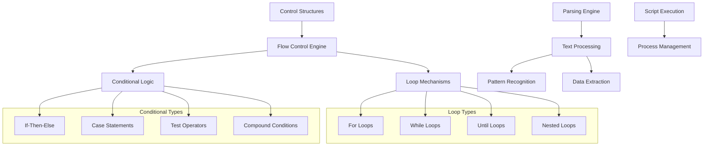
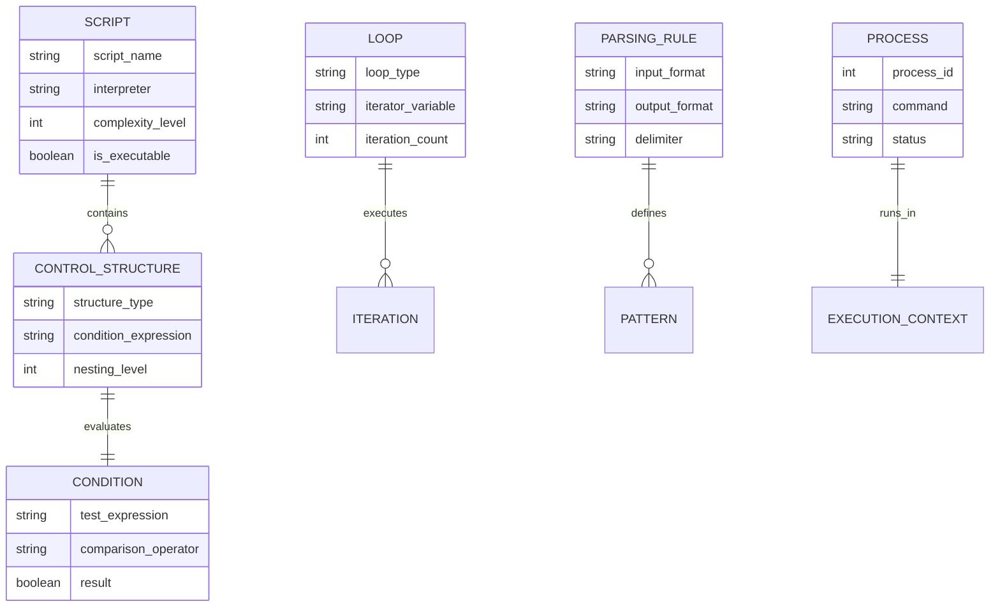
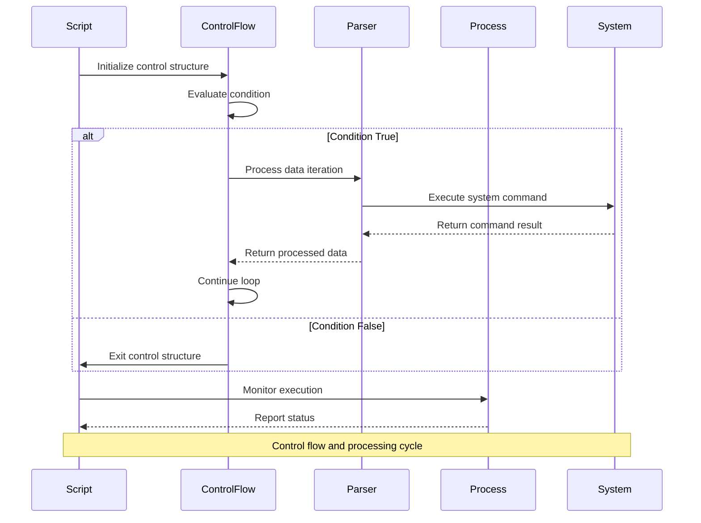

# 🏗️ System Architecture

## 📖 Overview
This container explores advanced shell scripting concepts including loops, conditional statements, and parsing operations. It demonstrates control flow structures, decision-making mechanisms, and text parsing techniques that enable sophisticated automation and data processing capabilities in shell environments.

---

## 🏛️ High-Level Architecture

The architecture demonstrates comprehensive shell control flow with advanced parsing and processing capabilities.

---

## 🧩 Core Components

### Control Flow Engine
- **Purpose**: Implements loop and conditional execution structures
- **Technology**: Bash control structures (for, while, if, case)
- **Location**: Control flow demonstration scripts
- **Responsibilities**:
  - Loop iteration management
  - Conditional branch execution
  - Flow control optimization
  - Error handling and recovery
- **Interfaces**: Script execution engine, variable system, command evaluation

### Parsing and Processing Layer
- **Purpose**: Handles text parsing, data extraction, and format conversion
- **Technology**: Shell text processing tools (awk, sed, grep, cut)
- **Location**: Parsing and data processing scripts
- **Responsibilities**:
  - Text pattern matching and extraction
  - Data format conversion
  - Structured data parsing
  - Report generation and formatting
- **Interfaces**: Text streams, regular expressions, data sources

### Process Management System
- **Purpose**: Manages script execution, process control, and signal handling
- **Technology**: Unix process control (ps, kill, jobs, signals)
- **Location**: Process management scripts
- **Responsibilities**:
  - Process monitoring and control
  - Signal handling and propagation
  - Job control and background processing
  - Resource monitoring and cleanup
- **Interfaces**: Unix process system, signal handling, job control

### Automation Framework
- **Purpose**: Provides structured automation and scripting capabilities
- **Technology**: Advanced shell scripting techniques
- **Location**: Automation and utility scripts
- **Responsibilities**:
  - Task automation and scheduling
  - Configuration management
  - System monitoring and maintenance
  - Error reporting and logging
- **Interfaces**: System services, configuration files, logging system

---

## 📊 Data Models & Schema

### Key Data Entities
- **Scripts**: Executable shell programs with control structures
- **Control Structures**: Flow control elements (loops, conditionals)
- **Conditions**: Boolean expressions for decision making
- **Parsing Rules**: Text processing and data extraction specifications
- **Processes**: Running script instances with execution context

### Relationships
- Scripts → Control Structures: Composition relationship for program logic
- Control Structures → Conditions: Evaluation relationship for flow control
- Loops → Iterations: Execution relationship for repetitive operations

---

## 🔄 Data Flow & Interactions

### Interaction Patterns
- **Loop Execution**: Condition evaluation → Iteration execution → Result processing → Condition re-evaluation
- **Conditional Branching**: Condition testing → Branch selection → Action execution → Flow continuation
- **Data Processing**: Input parsing → Transformation → Output formatting → Result delivery
- **Process Management**: Process creation → Monitoring → Control → Cleanup

---

## 🔒 Security & Permissions

### Script Security
- **Input Validation**: Sanitization of external data and user input
- **Privilege Management**: Controlled execution with minimal required privileges
- **Command Injection Prevention**: Safe parameter handling and quoting

### Best Practices
- Proper error handling to prevent information disclosure
- Secure temporary file handling
- Signal handling for graceful termination

---

## ⚡ Performance Considerations

### Optimization Strategies
- **Loop Optimization**: Efficient iteration patterns and early exit conditions
- **Process Efficiency**: Minimal subprocess creation and resource usage
- **Data Processing**: Streaming operations for large datasets

### Resource Management
- Memory-efficient loop structures
- Optimized parsing algorithms
- Controlled process spawning and cleanup

---

## 🧪 Testing Strategy

### Test Categories
- **Control Flow Tests**: Loop and conditional logic validation
- **Parsing Tests**: Data extraction and format conversion accuracy
- **Process Tests**: Script execution and process management verification
- **Integration Tests**: End-to-end automation workflow validation

### Validation Approach
- Logic flow verification with various input conditions
- Data processing accuracy with sample datasets
- Performance testing with large-scale operations
- Error handling validation with edge cases

---

## 📈 Scalability & Extensibility

### Design Patterns
- **Modular Control Structures**: Reusable loop and conditional components
- **Pluggable Parsers**: Extensible data processing modules
- **Scalable Automation**: Framework for complex automation workflows

### Future Enhancements
- Advanced error recovery mechanisms
- Parallel processing capabilities
- Enhanced monitoring and logging features

---

## 🔧 Configuration & Setup

### Prerequisites
- Unix/Linux operating system with full Bash capabilities
- Standard Unix utilities (ps, kill, awk, sed, grep)
- Understanding of shell scripting and process concepts

### Environment Setup
- Working directory: Container root with test scripts and data files
- Shell environment: Bash with job control and signal handling
- System access: Process monitoring and control capabilities

---

## 📚 Dependencies & Integration

### System Dependencies
- Bash shell with full scripting support
- Unix process management system
- Standard text processing utilities

### Integration Points
- System process integration
- Signal handling system
- Job control mechanism integration

---

## 🏷️ Metadata

- **Container**: 0x04-loops_conditions_and_parsing
- **Category**: System Engineering & DevOps
- **Complexity**: Advanced
- **Prerequisites**: Intermediate shell knowledge, understanding of control structures
- **Learning Path**: Foundation for advanced automation and system scripting
