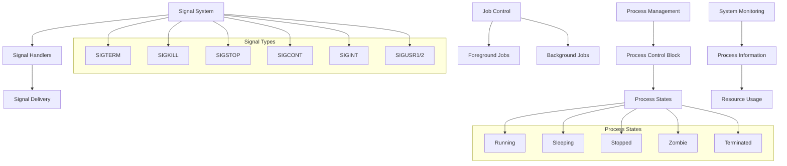
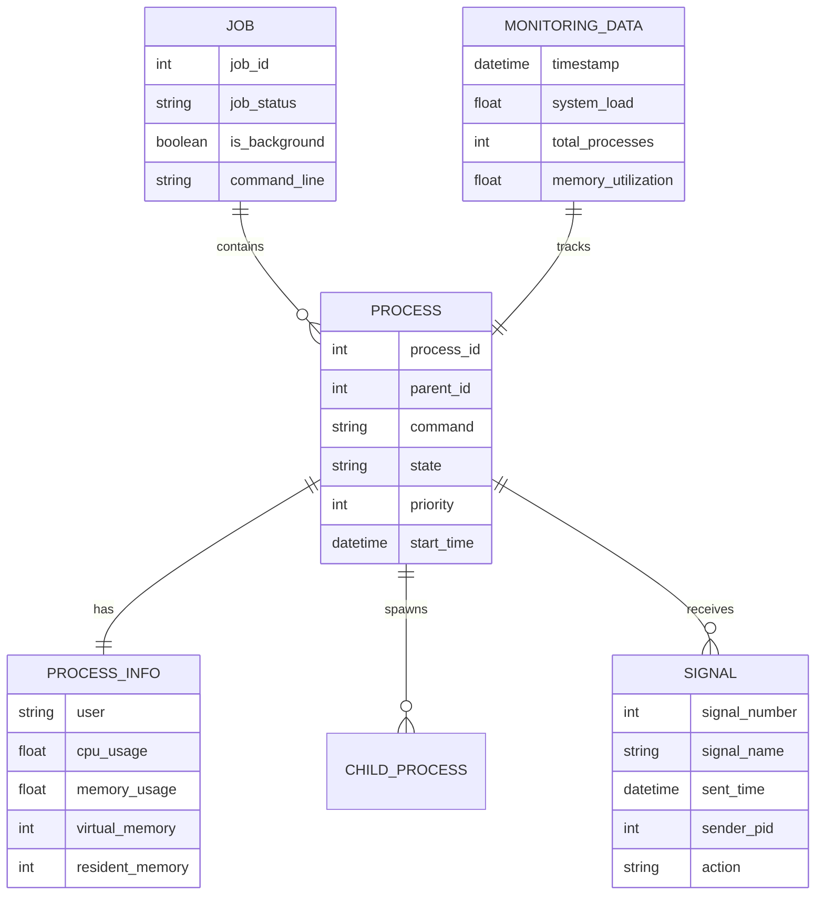
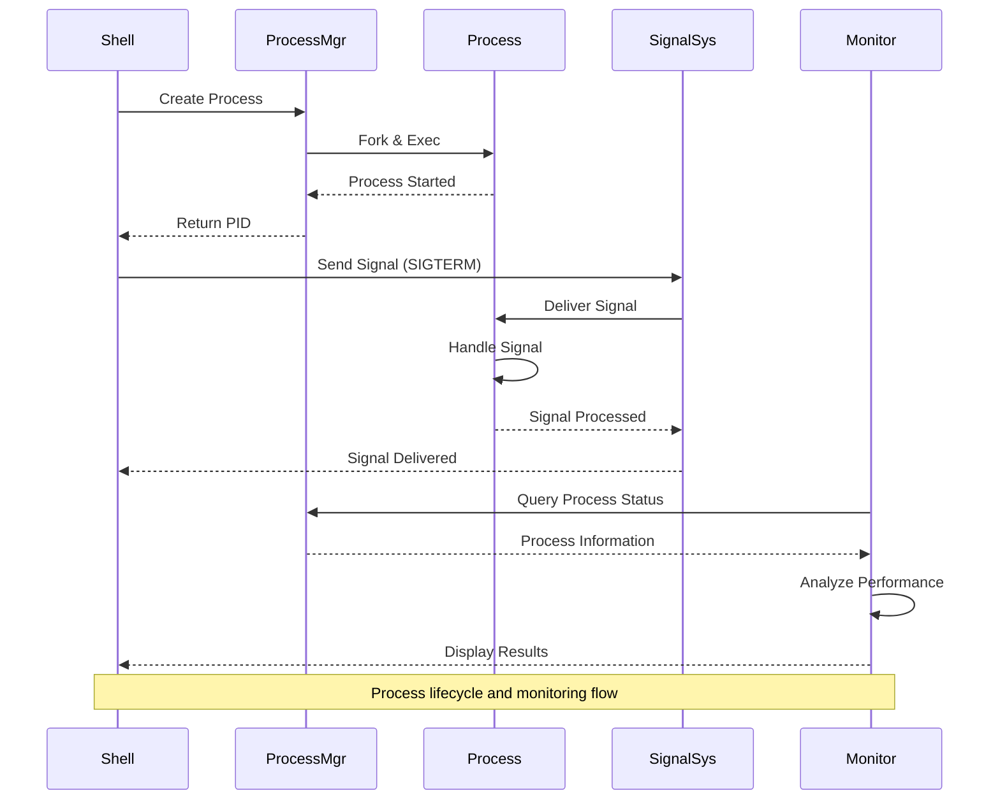

# 🏗️ System Architecture

## 📖 Overview
This container explores Unix/Linux process management, signal handling, and inter-process communication. It demonstrates process lifecycle management, signal propagation, job control, and system monitoring techniques that are fundamental to system administration and application management in Unix environments.

---

## 🏛️ High-Level Architecture

The architecture demonstrates comprehensive process and signal management with job control and system monitoring capabilities.

---

## 🧩 Core Components

### Process Management Engine
- **Purpose**: Handles process creation, monitoring, and lifecycle management
- **Technology**: Unix process system (fork, exec, wait, ps, kill)
- **Location**: Process management scripts and utilities
- **Responsibilities**:
  - Process creation and termination
  - Process state monitoring
  - Parent-child relationship management
  - Resource allocation and cleanup
- **Interfaces**: Unix kernel, process table, system calls

### Signal Handling System
- **Purpose**: Manages inter-process communication through signals
- **Technology**: Unix signal mechanism and handlers
- **Location**: Signal handling scripts and demonstrations
- **Responsibilities**:
  - Signal generation and delivery
  - Signal handler registration
  - Signal masking and blocking
  - Graceful process termination
- **Interfaces**: Signal system calls, process signal handlers, kernel signal delivery

### Job Control Framework
- **Purpose**: Provides shell job control and process group management
- **Technology**: Shell job control (jobs, fg, bg, nohup)
- **Location**: Job control demonstration scripts
- **Responsibilities**:
  - Foreground/background job management
  - Process group control
  - Session management
  - Terminal control and I/O redirection
- **Interfaces**: Shell environment, terminal control, process groups

### System Monitoring Layer
- **Purpose**: Provides real-time process and system resource monitoring
- **Technology**: System monitoring tools (ps, top, htop, pgrep, pkill)
- **Location**: Monitoring and analysis scripts
- **Responsibilities**:
  - Process information collection
  - Resource usage analysis
  - Performance monitoring
  - System health assessment
- **Interfaces**: Process filesystem (/proc), system statistics, performance counters

---

## 📊 Data Models & Schema

### Key Data Entities
- **Processes**: Individual program instances with unique identifiers
- **Process Information**: Detailed process metadata and resource usage
- **Signals**: Inter-process communication messages
- **Jobs**: Shell job control units containing one or more processes
- **Monitoring Data**: System-wide performance and resource metrics

### Relationships
- Processes → Child Processes: Parent-child hierarchical relationship
- Processes → Signals: Many-to-many communication relationship
- Jobs → Processes: Containment relationship for job control

---

## 🔄 Data Flow & Interactions

### Interaction Patterns
- **Process Creation**: Shell command → Process manager → Fork/exec → Process startup
- **Signal Communication**: Signal generation → Kernel delivery → Process handler → Action execution
- **Job Control**: Job state changes → Shell notification → User interface updates
- **Monitoring Flow**: Data collection → Analysis → Presentation → Alert generation

---

## 🔒 Security & Permissions

### Process Security
- **User Isolation**: Process ownership and privilege separation
- **Resource Limits**: CPU, memory, and file descriptor limits
- **Signal Security**: Controlled signal delivery based on ownership
- **Capability Management**: Fine-grained privilege control

### Signal Security
- **Permission Checks**: Signal delivery permission validation
- **Handler Security**: Secure signal handler implementation
- **Signal Masking**: Protection against unwanted signal interruption

### Monitoring Security
- **Access Control**: Restricted access to sensitive process information
- **Audit Logging**: Process activity logging for security analysis
- **Privacy Protection**: User process information protection

---

## ⚡ Performance Considerations

### Optimization Strategies
- **Efficient Process Management**: Minimal overhead for process operations
- **Signal Optimization**: Fast signal delivery and handling
- **Monitoring Efficiency**: Low-impact system monitoring
- **Resource Optimization**: Efficient resource allocation and cleanup

### Performance Monitoring
- **Process Performance**: CPU and memory usage tracking
- **Signal Performance**: Signal delivery latency measurement
- **System Performance**: Overall system health monitoring
- **Bottleneck Detection**: Performance bottleneck identification

---

## 🧪 Testing Strategy

### Test Categories
- **Process Management Tests**: Process creation, termination, and state changes
- **Signal Handling Tests**: Signal delivery, handling, and edge cases
- **Job Control Tests**: Foreground/background job management
- **Monitoring Tests**: Data accuracy and performance impact

### Validation Approach
- Process lifecycle validation with various scenarios
- Signal handling accuracy with different signal types
- Job control behavior verification in various states
- Monitoring data accuracy and consistency checks

---

## 📈 Scalability & Extensibility

### Design Patterns
- **Modular Process Operations**: Independent process management components
- **Extensible Signal Handling**: Pluggable signal handler framework
- **Scalable Monitoring**: Distributed monitoring architecture

### Future Enhancements
- **Advanced Process Analytics**: Machine learning for process behavior analysis
- **Distributed Process Management**: Multi-host process coordination
- **Enhanced Signal Systems**: Custom signal types and advanced routing
- **Real-time Monitoring**: High-frequency monitoring with minimal overhead

---

## 🔧 Configuration & Setup

### Prerequisites
- Unix/Linux operating system with full process support
- Understanding of Unix process concepts and signal mechanisms
- Access to system monitoring tools and utilities
- Shell environment with job control capabilities

### Environment Setup
- Working directory: Container root with process management scripts
- System access: Process creation and signal sending capabilities
- Monitoring tools: System monitoring utilities installed and configured
- Shell environment: Full job control and signal handling support

---

## 📚 Dependencies & Integration

### System Dependencies
- Unix process management system
- Signal handling infrastructure
- Shell with job control support
- System monitoring utilities (ps, top, htop)

### Integration Points
- Kernel process management integration
- Signal system integration
- Shell environment integration
- System monitoring tool integration

---

## 🏷️ Metadata

- **Container**: 0x05-processes_and_signals
- **Category**: System Engineering & DevOps
- **Complexity**: Advanced
- **Prerequisites**: Unix process concepts, signal handling, job control understanding
- **Learning Path**: Essential for system administration and process management
