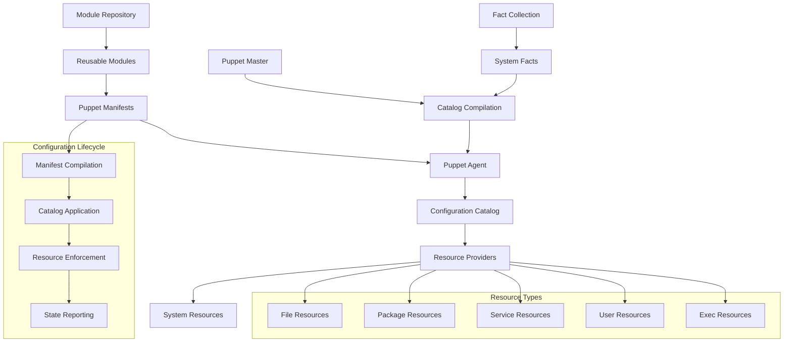
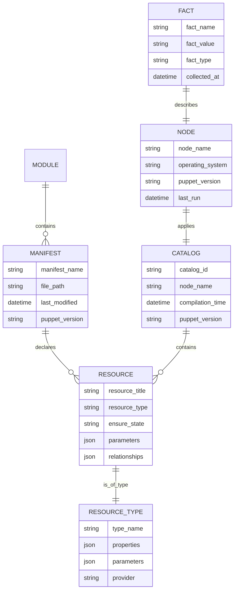
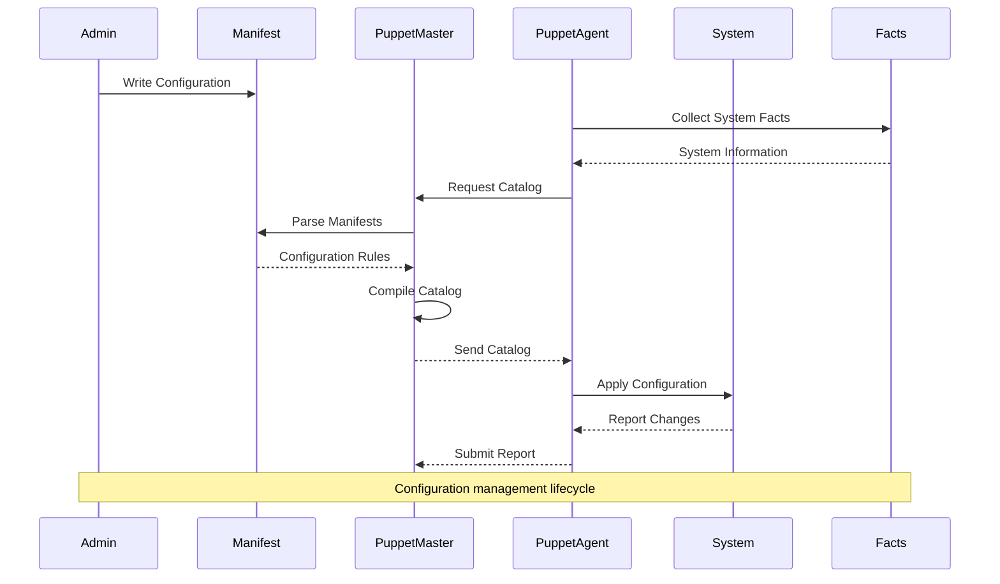

# 🏗️ System Architecture

## 📖 Overview
This container introduces the fundamentals of configuration management using Puppet, a powerful tool for automating infrastructure. It demonstrates infrastructure as code principles, declarative configuration management, and automated server provisioning that enables consistent, scalable, and maintainable infrastructure deployment and management.

---

## 🏛️ High-Level Architecture

The architecture demonstrates comprehensive configuration management with declarative infrastructure definition and automated enforcement capabilities.

---

## 🧩 Core Components

### Puppet Manifest Engine
- **Purpose**: Defines infrastructure configuration in declarative syntax
- **Technology**: Puppet Domain Specific Language (DSL)
- **Location**: Puppet manifest files (*.pp)
- **Responsibilities**:
  - Infrastructure state declaration
  - Resource relationship definition
  - Configuration parameter specification
  - Dependency management
- **Interfaces**: Puppet compiler, resource catalog, external data sources

### Resource Management System
- **Purpose**: Manages system resources and enforces desired state
- **Technology**: Puppet resource providers and types
- **Location**: Built-in and custom resource providers
- **Responsibilities**:
  - File and directory management
  - Package installation and updates
  - Service configuration and control
  - User and group management
- **Interfaces**: Operating system APIs, package managers, service managers

### Configuration Catalog
- **Purpose**: Compiled configuration instructions for target systems
- **Technology**: Puppet catalog compilation and distribution
- **Location**: Compiled catalog cache and distribution system
- **Responsibilities**:
  - Manifest compilation and optimization
  - Resource dependency resolution
  - Configuration validation
  - Change detection and reporting
- **Interfaces**: Puppet agents, manifest sources, fact collection

### Fact Collection Framework
- **Purpose**: Gathers system information for configuration decisions
- **Technology**: Facter system information collection
- **Location**: System fact collectors and custom facts
- **Responsibilities**:
  - System hardware and software inventory
  - Operating system information collection
  - Network configuration discovery
  - Custom fact generation
- **Interfaces**: System APIs, hardware interfaces, network discovery

---

## 📊 Data Models & Schema

### Key Data Entities
- **Manifests**: Declarative configuration files defining desired system state
- **Resources**: Individual configuration items (files, packages, services)
- **Resource Types**: Categories of manageable system components
- **Catalogs**: Compiled configuration instructions for specific nodes
- **Nodes**: Target systems receiving configuration management
- **Facts**: System information used for configuration decisions

### Relationships
- Manifests → Resources: Declaration relationship for infrastructure components
- Resources → Resource Types: Classification relationship for management capabilities
- Catalogs → Resources: Compilation relationship for execution planning

---

## 🔄 Data Flow & Interactions

### Interaction Patterns
- **Configuration Definition**: Admin creates manifests → Manifest parsing → Syntax validation
- **Catalog Compilation**: Fact collection → Manifest processing → Dependency resolution → Catalog generation
- **Configuration Application**: Catalog retrieval → Resource processing → System changes → Status reporting
- **State Enforcement**: Periodic runs → State comparison → Corrective actions → Compliance reporting

---

## 🔒 Security & Permissions

### Configuration Security
- **Access Control**: Manifest access restrictions and version control
- **Certificate Management**: SSL/TLS certificates for secure communication
- **Privilege Escalation**: Controlled privilege elevation for system changes
- **Audit Logging**: Configuration change logging and tracking

### Resource Security
- **Permission Management**: File and directory permission enforcement
- **User Security**: Secure user and group management
- **Service Security**: Secure service configuration and startup
- **Package Security**: Verified package installation and updates

### Communication Security
- **Encrypted Communication**: SSL/TLS for master-agent communication
- **Authentication**: Certificate-based node authentication
- **Authorization**: Role-based access control for configuration access

---

## ⚡ Performance Considerations

### Optimization Strategies
- **Catalog Optimization**: Efficient catalog compilation and caching
- **Resource Ordering**: Optimized resource application order
- **Fact Caching**: Intelligent fact collection and caching
- **Module Efficiency**: Reusable module design patterns

### Scalability Features
- **Distributed Architecture**: Multi-master configurations for scale
- **Catalog Caching**: Intelligent caching strategies
- **Parallel Execution**: Concurrent resource application
- **Resource Optimization**: Efficient resource provider implementations

---

## 🧪 Testing Strategy

### Test Categories
- **Manifest Syntax Tests**: Puppet DSL syntax and structure validation
- **Resource Tests**: Individual resource behavior and state enforcement
- **Catalog Tests**: Compilation accuracy and dependency resolution
- **Integration Tests**: End-to-end configuration application validation

### Validation Approach
- Syntax validation with puppet parser validate
- Unit testing with rspec-puppet framework
- Integration testing in isolated environments
- Acceptance testing with real system configurations

---

## 📈 Scalability & Extensibility

### Design Patterns
- **Modular Configuration**: Reusable module design and organization
- **Hierarchical Data**: Hiera for data separation and management
- **Role-Based Design**: Node classification and role assignment
- **Environment Management**: Multi-environment configuration strategies

### Future Enhancements
- **Advanced Orchestration**: Complex deployment workflow management
- **Cloud Integration**: Cloud provider resource management
- **Container Support**: Docker and Kubernetes resource management
- **Compliance Automation**: Automated compliance checking and reporting

---

## 🔧 Configuration & Setup

### Prerequisites
- Linux operating system with Puppet agent support
- Understanding of system administration concepts
- Basic knowledge of configuration management principles
- Network connectivity for agent-master communication

### Environment Setup
- **Puppet Installation**: Puppet agent installation and configuration
- **Certificate Setup**: SSL certificate generation and distribution
- **Module Path**: Puppet module path and organization
- **Fact Collection**: Custom fact development and deployment

---

## 📚 Dependencies & Integration

### System Dependencies
- Puppet agent software
- Ruby runtime environment
- SSL certificate infrastructure
- System package managers

### Integration Points
- **Version Control Integration**: Git integration for manifest management
- **Monitoring Integration**: Integration with monitoring and alerting systems
- **CI/CD Integration**: Continuous integration and deployment pipelines
- **Cloud Integration**: Cloud provider APIs and resource management

---

## 🏷️ Metadata

- **Container**: 0x0A-configuration_management
- **Category**: System Engineering & DevOps
- **Complexity**: Intermediate
- **Prerequisites**: System administration knowledge, infrastructure concepts
- **Learning Path**: Foundation for Infrastructure as Code and DevOps practices
