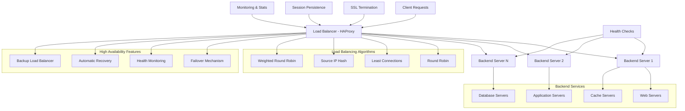
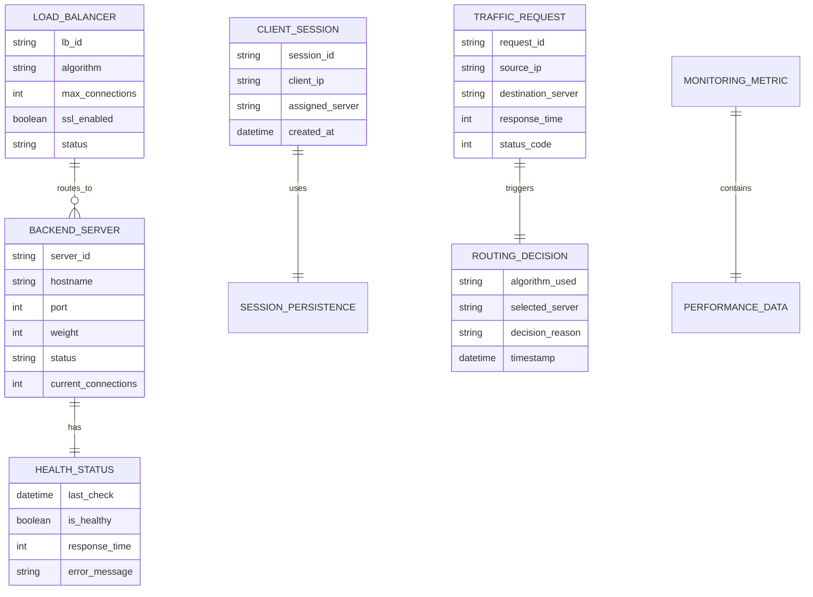
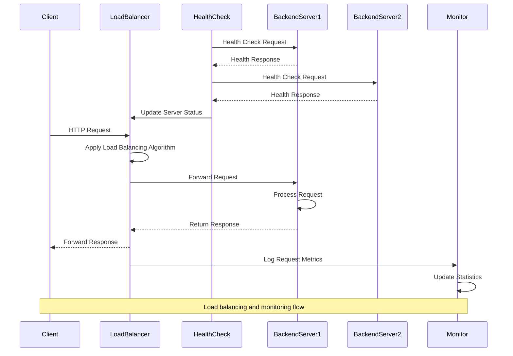

# 🏗️ System Architecture

## 📖 Overview
This container focuses on load balancing concepts and implementation using HAProxy. It demonstrates traffic distribution, high availability configurations, health checking, and load balancing algorithms that ensure optimal resource utilization and fault tolerance in distributed systems.

---

## 🏛️ High-Level Architecture

The architecture demonstrates comprehensive load balancing with high availability, health monitoring, and intelligent traffic distribution capabilities.

---

## 🧩 Core Components

### HAProxy Load Balancer Core
- **Purpose**: Central traffic distribution and load balancing engine
- **Technology**: HAProxy with advanced load balancing features
- **Location**: HAProxy configuration files and scripts
- **Responsibilities**:
  - Request routing and distribution
  - Load balancing algorithm implementation
  - Connection management and pooling
  - SSL termination and security
- **Interfaces**: Client connections, backend servers, monitoring systems

### Health Check System
- **Purpose**: Monitors backend server availability and performance
- **Technology**: HTTP/TCP health check mechanisms
- **Location**: Health check configuration and monitoring scripts
- **Responsibilities**:
  - Server availability monitoring
  - Performance metric collection
  - Automatic server removal/addition
  - Health status reporting
- **Interfaces**: Backend servers, load balancer configuration, alerting systems

### Session Management Layer
- **Purpose**: Handles session persistence and state management
- **Technology**: Cookie-based and IP-based session persistence
- **Location**: Session configuration modules
- **Responsibilities**:
  - Session affinity management
  - Sticky session implementation
  - Session failover handling
  - State synchronization
- **Interfaces**: Client sessions, backend applications, persistence storage

### Traffic Analytics and Monitoring
- **Purpose**: Provides real-time traffic analysis and performance monitoring
- **Technology**: HAProxy stats interface, logging, and monitoring tools
- **Location**: Monitoring and analytics configuration
- **Responsibilities**:
  - Traffic pattern analysis
  - Performance metric collection
  - Real-time dashboard updates
  - Alert generation and notification
- **Interfaces**: HAProxy stats, external monitoring systems, dashboards

---

## 📊 Data Models & Schema

### Key Data Entities
- **Load Balancer**: Central routing component with configuration and status
- **Backend Servers**: Destination servers with capacity and health information
- **Health Status**: Real-time server availability and performance data
- **Client Sessions**: User session state and server affinity information
- **Traffic Requests**: Individual request routing and performance data
- **Routing Decisions**: Load balancing algorithm decisions and reasoning

### Relationships
- Load Balancer → Backend Servers: One-to-many routing relationship
- Backend Servers → Health Status: One-to-one monitoring relationship
- Client Sessions → Backend Servers: Many-to-one affinity relationship

---

## 🔄 Data Flow & Interactions

### Interaction Patterns
- **Request Routing**: Client request → Algorithm selection → Server assignment → Response forwarding
- **Health Monitoring**: Periodic health checks → Status updates → Routing table updates
- **Session Management**: Session identification → Server affinity → Consistent routing
- **Performance Monitoring**: Request logging → Metric aggregation → Dashboard updates

---

## 🔒 Security & Permissions

### Load Balancer Security
- **SSL/TLS Termination**: Encrypted communication with certificate management
- **DDoS Protection**: Rate limiting and connection throttling
- **Access Control**: IP whitelisting and geographic restrictions
- **Security Headers**: HTTP security header injection

### Backend Security
- **Secure Communication**: Encrypted backend connections where required
- **Authentication**: Backend server authentication and authorization
- **Network Isolation**: Private network segments for backend traffic

### Monitoring Security
- **Secure Statistics**: Protected access to HAProxy statistics interface
- **Log Security**: Secure log transmission and storage
- **Alert Security**: Encrypted monitoring and alerting communications

---

## ⚡ Performance Considerations

### Optimization Strategies
- **Connection Pooling**: Efficient connection reuse and management
- **Caching**: Response caching and static content optimization
- **Compression**: HTTP compression for bandwidth optimization
- **Keep-Alive**: Persistent connection management

### Load Balancing Optimization
- **Algorithm Selection**: Optimal algorithm based on workload characteristics
- **Weight Tuning**: Dynamic server weight adjustment based on capacity
- **Health Check Tuning**: Optimal health check frequency and timeouts
- **Session Optimization**: Efficient session persistence mechanisms

### Resource Management
- **Memory Optimization**: Efficient memory usage for connection handling
- **CPU Optimization**: Minimal CPU overhead for request processing
- **Network Optimization**: Bandwidth utilization and latency minimization

---

## 🧪 Testing Strategy

### Test Categories
- **Load Balancing Tests**: Algorithm behavior and traffic distribution validation
- **Health Check Tests**: Server failure detection and recovery verification
- **Performance Tests**: Throughput and latency under various load conditions
- **Failover Tests**: High availability and disaster recovery scenarios

### Validation Approach
- Traffic distribution analysis with various load patterns
- Server failure simulation and automatic recovery testing
- Performance benchmarking under peak load conditions
- Session persistence validation across server failures

---

## 📈 Scalability & Extensibility

### Scaling Strategies
- **Horizontal Scaling**: Additional backend servers for increased capacity
- **Load Balancer Clustering**: Multiple load balancer instances for high availability
- **Geographic Distribution**: Multi-region load balancing and traffic routing
- **Auto-Scaling**: Dynamic backend server provisioning based on demand

### Future Enhancements
- **Advanced Algorithms**: Machine learning-based load balancing
- **API Gateway Integration**: Microservices routing and management
- **Container Orchestration**: Kubernetes integration for dynamic service discovery
- **Edge Computing**: CDN integration and edge load balancing

---

## 🔧 Configuration & Setup

### Prerequisites
- Linux operating system with HAProxy support
- Understanding of networking concepts and HTTP protocols
- Access to multiple backend servers for load balancing
- SSL certificates for HTTPS termination

### Environment Setup
- **Load Balancer Server**: HAProxy installation with configuration files
- **Backend Servers**: Multiple web/application servers for traffic distribution
- **Monitoring Setup**: Statistics interface and external monitoring tools
- **Network Configuration**: Proper routing and firewall rules

---

## 📚 Dependencies & Integration

### System Dependencies
- HAProxy load balancer software
- Linux networking stack
- SSL/TLS certificate management tools
- System monitoring and logging utilities

### Integration Points
- **Backend Application Integration**: Health check endpoints and session management
- **Monitoring System Integration**: Metrics collection and alerting platforms
- **SSL Certificate Integration**: Certificate management and renewal systems
- **DNS Integration**: Service discovery and traffic routing

---

## 🏷️ Metadata

- **Container**: 0x0F-load_balancer
- **Category**: System Engineering & DevOps
- **Complexity**: Advanced
- **Prerequisites**: Networking knowledge, web server administration, high availability concepts
- **Learning Path**: Essential for scalable and resilient distributed systems
