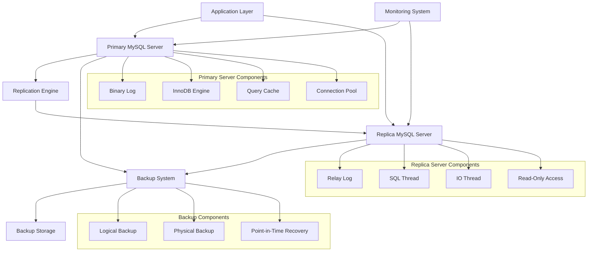
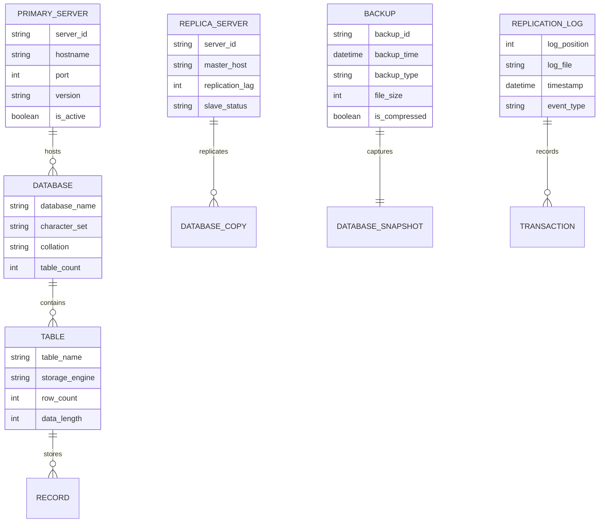
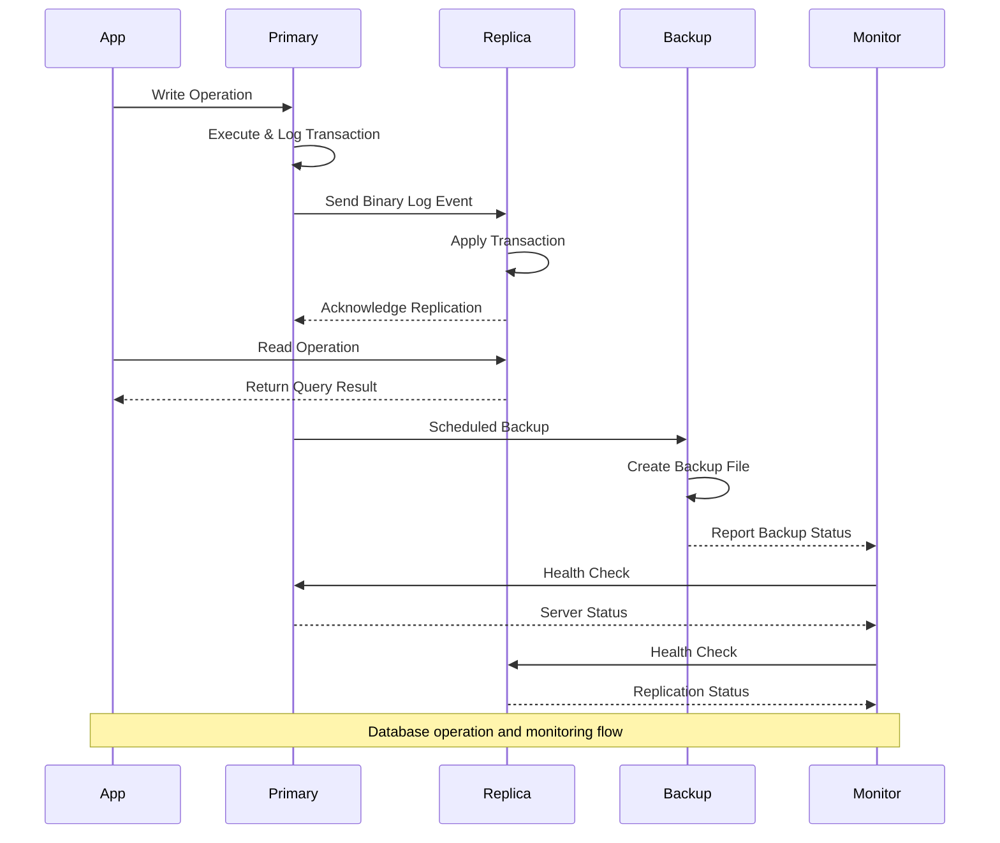

# 🏗️ System Architecture

## 📖 Overview
This container focuses on MySQL database management with an emphasis on high availability and fault tolerance through primary-replica replication. It demonstrates critical database operations including backup strategies, restoration procedures, replication configuration, and database administration practices that ensure data integrity and business continuity.

---

## 🏛️ High-Level Architecture

The architecture demonstrates a comprehensive MySQL high-availability setup with replication, backup, and monitoring capabilities.

---

## 🧩 Core Components

### Primary MySQL Server
- **Purpose**: Main database server handling write operations and serving as replication source
- **Technology**: MySQL 8.0+ with InnoDB storage engine
- **Location**: Primary server configuration files
- **Responsibilities**:
  - Processing write operations (INSERT, UPDATE, DELETE)
  - Binary log generation for replication
  - Query optimization and execution
  - Connection management and security
- **Interfaces**: Application connections, replication slaves, backup systems

### Replica MySQL Server
- **Purpose**: Standby database server for read operations and failover capability
- **Technology**: MySQL 8.0+ configured as replica
- **Location**: Replica server configuration files
- **Responsibilities**:
  - Replicating data from primary server
  - Serving read-only queries
  - Maintaining data consistency
  - Providing failover capabilities
- **Interfaces**: Primary server replication, read-only application connections

### Replication Management System
- **Purpose**: Handles data synchronization between primary and replica servers
- **Technology**: MySQL binary log replication (statement/row/mixed)
- **Location**: Replication configuration scripts
- **Responsibilities**:
  - Binary log management and shipping
  - Relay log processing on replica
  - Replication lag monitoring
  - Conflict resolution and error handling
- **Interfaces**: MySQL replication threads, monitoring systems, alerting

### Backup and Recovery Framework
- **Purpose**: Ensures data protection through comprehensive backup strategies
- **Technology**: mysqldump, mysqlpump, physical backup tools
- **Location**: Backup scripts and procedures
- **Responsibilities**:
  - Scheduled backup execution
  - Backup validation and integrity checking
  - Point-in-time recovery capabilities
  - Backup rotation and retention management
- **Interfaces**: MySQL servers, storage systems, monitoring, alerting

---

## 📊 Data Models & Schema

### Key Data Entities
- **Primary Server**: Main database instance with full read/write capabilities
- **Replica Server**: Secondary database instance with read-only access
- **Databases**: Logical containers for related tables and data
- **Tables**: Structured data storage with defined schemas
- **Backups**: Point-in-time snapshots for disaster recovery
- **Replication Logs**: Transaction logs for data synchronization

### Relationships
- Primary → Replica: Master-slave replication relationship
- Server → Databases: One-to-many hosting relationship
- Databases → Tables: Logical containment relationship
- Backups → Databases: Snapshot preservation relationship

---

## 🔄 Data Flow & Interactions

### Interaction Patterns
- **Write Operations**: Application → Primary server → Binary log → Replica synchronization
- **Read Operations**: Application → Replica server (load balancing) → Query result
- **Backup Process**: Scheduled trigger → Backup execution → Validation → Storage
- **Monitoring Flow**: Continuous health checks → Status reporting → Alert generation

---

## 🔒 Security & Permissions

### Database Security
- **Authentication**: MySQL user accounts with strong password policies
- **Authorization**: Role-based access control with minimal privileges
- **Encryption**: SSL/TLS for data in transit, encryption at rest for sensitive data
- **Network Security**: Firewall rules restricting database access

### Replication Security
- **Secure Channels**: SSL encryption for replication connections
- **Authentication**: Dedicated replication user with restricted privileges
- **Access Control**: Network-level restrictions for replication traffic

### Backup Security
- **Encryption**: Backup file encryption for sensitive data
- **Access Control**: Restricted access to backup storage locations
- **Integrity Checking**: Backup validation and checksums

---

## ⚡ Performance Considerations

### Optimization Strategies
- **Query Optimization**: Index usage, query plan optimization
- **Replication Tuning**: Parallel replication, optimized binary log format
- **Backup Optimization**: Incremental backups, compressed backups
- **Connection Management**: Connection pooling, efficient resource usage

### Monitoring and Metrics
- **Replication Lag**: Continuous monitoring of replica delay
- **Query Performance**: Slow query analysis and optimization
- **Resource Usage**: CPU, memory, disk I/O monitoring
- **Backup Performance**: Backup duration and success rate tracking

---

## 🧪 Testing Strategy

### Test Categories
- **Replication Tests**: Data consistency and lag verification
- **Backup Tests**: Backup integrity and restoration procedures
- **Failover Tests**: Primary-replica switching scenarios
- **Performance Tests**: Load testing and capacity planning

### Validation Approach
- Automated data consistency checks between primary and replica
- Regular backup restoration testing in isolated environments
- Simulated failure scenarios for failover validation
- Performance benchmarking under various load conditions

---

## 📈 Scalability & Extensibility

### Scaling Strategies
- **Read Scaling**: Multiple replica servers for read load distribution
- **Vertical Scaling**: Hardware upgrades for increased capacity
- **Horizontal Scaling**: Sharding and partitioning strategies
- **Caching**: Query result caching and application-level caching

### Future Enhancements
- **Multi-Master Replication**: Bidirectional replication setup
- **Automated Failover**: Orchestrated failover with minimal downtime
- **Advanced Monitoring**: Predictive analytics for performance optimization
- **Cloud Integration**: Hybrid cloud backup and disaster recovery

---

## 🔧 Configuration & Setup

### Prerequisites
- Linux operating system with MySQL 8.0+ support
- Sufficient hardware resources (CPU, RAM, storage)
- Network connectivity between primary and replica servers
- Understanding of MySQL administration concepts

### Environment Setup
- **Primary Server**: Full read/write MySQL instance with binary logging enabled
- **Replica Server**: Read-only MySQL instance configured for replication
- **Backup System**: Dedicated backup storage with retention policies
- **Monitoring**: Database monitoring tools and alerting systems

---

## 📚 Dependencies & Integration

### System Dependencies
- MySQL 8.0+ database server
- Linux operating system utilities
- Network infrastructure for replication
- Storage systems for backup retention

### Integration Points
- **Application Integration**: Database connection libraries and ORMs
- **Monitoring Integration**: Database monitoring tools (Prometheus, Grafana)
- **Backup Integration**: Storage systems (local, cloud, tape)
- **Orchestration Integration**: Infrastructure automation tools

---

## 🏷️ Metadata

- **Container**: 0x14-mysql
- **Category**: System Engineering & DevOps
- **Complexity**: Advanced
- **Prerequisites**: Database administration knowledge, Linux system administration
- **Learning Path**: Essential for database reliability and high-availability systems
