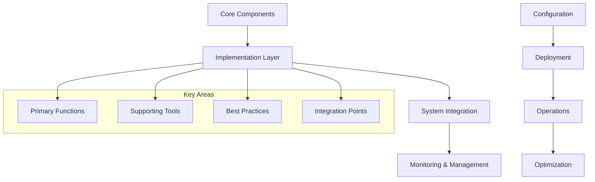
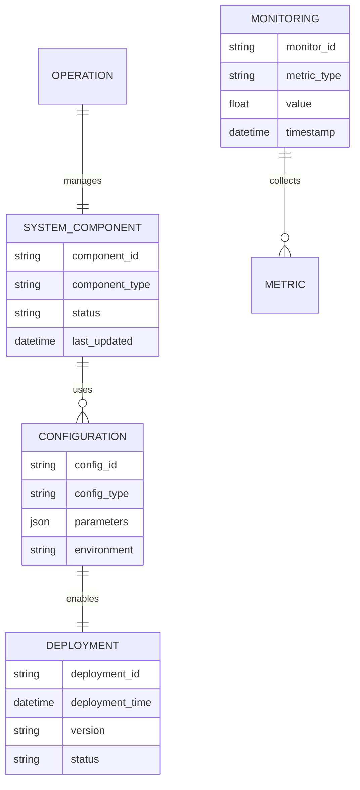
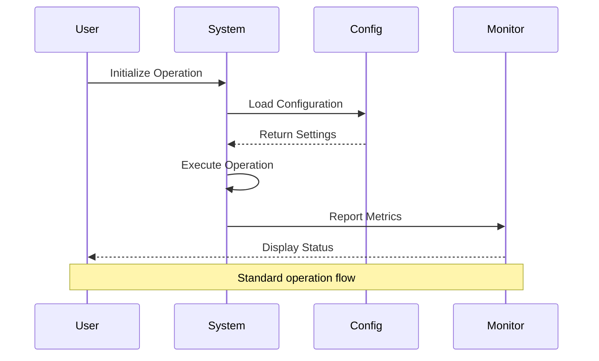

# 🏗️ System Architecture

## 📖 Overview
This container focuses on incident response, postmortem analysis, root cause investigation, documentation practices, and continuous improvement processes. It provides comprehensive coverage of concepts, tools, and practices essential for system engineering and DevOps operations in modern infrastructure environments.

---

## 🏛️ High-Level Architecture

The architecture demonstrates a comprehensive approach to incident response, postmortem analysis, root cause investigation, documentation practices, and continuous improvement processes with focus on practical implementation and operational excellence.

---

## 🧩 Core Components

### Primary Implementation Layer
- **Purpose**: Core functionality implementation for incident response, postmortem analysis, root cause investigation, documentation practices, and continuous improvement processes
- **Technology**: Industry-standard tools and technologies
- **Location**: Primary configuration and implementation files
- **Responsibilities**:
  - Core feature implementation
  - Configuration management
  - System integration
  - Performance optimization
- **Interfaces**: System APIs, external services, monitoring systems

### Configuration Management System
- **Purpose**: Manages system configuration and deployment settings
- **Technology**: Configuration files, scripts, and automation tools
- **Location**: Configuration files and management scripts
- **Responsibilities**:
  - Environment configuration
  - Deployment automation
  - Version control integration
  - Change management
- **Interfaces**: Deployment systems, version control, monitoring

### Operations and Monitoring Framework
- **Purpose**: Provides operational oversight and system monitoring
- **Technology**: Monitoring tools, logging systems, alerting mechanisms
- **Location**: Monitoring configurations and operational scripts
- **Responsibilities**:
  - System health monitoring
  - Performance tracking
  - Alert management
  - Operational reporting
- **Interfaces**: Monitoring platforms, alerting systems, dashboards

---

## 📊 Data Models & Schema

### Key Data Entities
- **System Components**: Core system elements and their configurations
- **Configurations**: System settings and deployment parameters
- **Deployments**: Version management and release tracking
- **Monitoring Data**: Performance metrics and system health indicators

---

## 🔄 Data Flow & Interactions

### Interaction Patterns
- **Configuration Loading**: System startup → Configuration retrieval → Parameter application
- **Operation Execution**: User request → System processing → Result delivery
- **Monitoring Flow**: Metric collection → Analysis → Reporting → Alerting

---

## 🔒 Security & Permissions

### Security Framework
- **Access Control**: Role-based access control and permission management
- **Data Protection**: Encryption at rest and in transit
- **Audit Logging**: Comprehensive activity logging and monitoring
- **Compliance**: Industry standard compliance and security practices

### Best Practices
- Principle of least privilege access
- Regular security assessments and updates
- Secure configuration management
- Incident response procedures

---

## ⚡ Performance Considerations

### Optimization Strategies
- **Resource Efficiency**: Optimal resource utilization and management
- **Caching**: Strategic caching for improved performance
- **Load Distribution**: Efficient load balancing and distribution
- **Monitoring**: Real-time performance monitoring and tuning

### Scalability Features
- Horizontal and vertical scaling capabilities
- Auto-scaling based on demand
- Performance monitoring and optimization
- Resource allocation optimization

---

## 🧪 Testing Strategy

### Test Categories
- **Functional Tests**: Core functionality validation
- **Performance Tests**: Load and stress testing
- **Security Tests**: Security vulnerability assessment
- **Integration Tests**: End-to-end system validation

### Validation Approach
- Automated testing frameworks
- Continuous integration validation
- Performance benchmarking
- Security scanning and assessment

---

## 📈 Scalability & Extensibility

### Design Patterns
- **Modular Architecture**: Component-based design for flexibility
- **API-First Design**: RESTful APIs for integration
- **Microservices**: Service-oriented architecture patterns
- **Event-Driven**: Asynchronous processing capabilities

### Future Enhancements
- Cloud-native architecture migration
- Advanced automation capabilities
- Enhanced monitoring and observability
- AI/ML integration for optimization

---

## 🔧 Configuration & Setup

### Prerequisites
- Modern Linux/Unix operating system
- Required dependencies and tools
- Network connectivity and permissions
- Understanding of core concepts

### Environment Setup
- Installation and configuration procedures
- Environment variable configuration
- Service startup and initialization
- Validation and testing procedures

---

## 📚 Dependencies & Integration

### System Dependencies
- Core system utilities and libraries
- Third-party tools and services
- Network and infrastructure requirements
- Security and compliance tools

### Integration Points
- External system integrations
- API and service integrations
- Monitoring and logging systems
- CI/CD pipeline integration

---

## 🏷️ Metadata

- **Container**: 0x19-postmortem
- **Category**: System Engineering & DevOps
- **Complexity**: Varies based on specific implementation
- **Prerequisites**: Foundation knowledge in system administration
- **Learning Path**: Progressive skill development in incident response, postmortem analysis, root cause investigation, documentation practices, and continuous improvement processes
