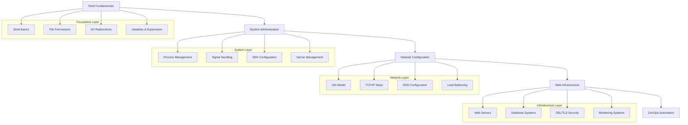
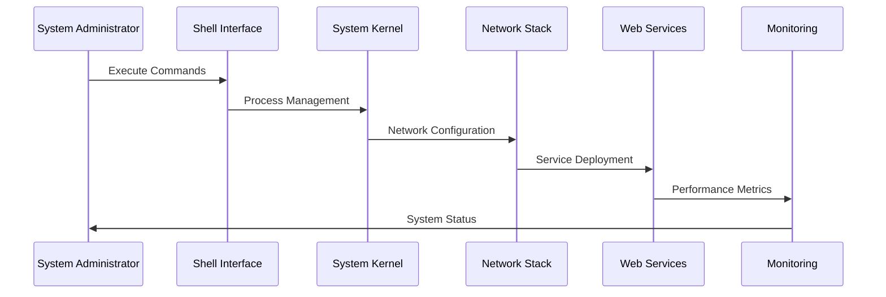
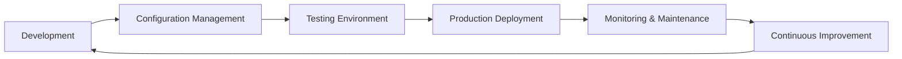

# 🏗️ System Architecture

## 📖 Overview
This repository implements a comprehensive system engineering and DevOps learning architecture that progresses from basic shell operations to complex web infrastructure design. The architecture demonstrates the evolution of skills from foundational system administration to advanced DevOps practices, including automation, monitoring, and scalable web infrastructure.

---

## 🏛️ High-Level Architecture

The architecture demonstrates a layered approach to system engineering education, where each layer builds upon the previous one.

---

## 🧩 Core Components

### Shell Fundamentals Layer
- **Purpose**: Establish foundational command-line skills and scripting capabilities
- **Technology**: Bash, shell scripting, UNIX utilities
- **Location**: `0x00-shell_basics/`, `0x01-shell_permissions/`, `0x02-shell_redirections/`, `0x03-shell_variables_expansions/`
- **Responsibilities**:
  - File system navigation and manipulation
  - Permission management and access control
  - I/O redirection and text processing
  - Variable handling and shell expansions

### System Administration Layer
- **Purpose**: Manage system processes, services, and configurations
- **Technology**: Process management, systemd, SSH, cron
- **Location**: `0x04-loops_conditions_and_parsing/`, `0x05-processes_and_signals/`, `0x0B-ssh/`
- **Responsibilities**:
  - Advanced shell scripting with control structures
  - Process lifecycle management
  - Secure shell access configuration
  - System automation and scheduling

### Network Configuration Layer
- **Purpose**: Implement networking concepts and protocols
- **Technology**: TCP/IP, DNS, network utilities
- **Location**: `0x07-networking_basics/`, `0x08-networking_basics_2/`
- **Responsibilities**:
  - Network protocol implementation
  - IP addressing and subnetting
  - Network troubleshooting and diagnostics
  - Network service configuration

### Web Infrastructure Layer
- **Purpose**: Design and implement scalable web architectures
- **Technology**: Nginx, Apache, HAProxy, MySQL, SSL/TLS
- **Location**: `0x09-web_infrastructure_design/`, `0x0C-web_server/`, `0x0F-load_balancer/`, `0x10-https_ssl/`, `0x14-mysql/`
- **Responsibilities**:
  - Web server configuration and optimization
  - Load balancing and high availability
  - Database management and replication
  - Security implementation with SSL/TLS

### DevOps Automation Layer
- **Purpose**: Implement automation, monitoring, and continuous improvement
- **Technology**: Puppet, monitoring tools, APIs
- **Location**: `0x0A-configuration_management/`, `0x18-webstack_monitoring/`, `0x15-api/`, `0x16-api_advanced/`
- **Responsibilities**:
  - Configuration management and automation
  - System monitoring and alerting
  - API development and integration
  - Infrastructure as code practices

---

## 🔄 Data Flow

---

## 🔐 Security Architecture

### Access Control
- **SSH Key Management**: Secure authentication mechanisms
- **File Permissions**: Principle of least privilege
- **Firewall Configuration**: Network access control
- **SSL/TLS Implementation**: Encrypted communications

### Security Layers
1. **System Level**: User permissions, process isolation
2. **Network Level**: Firewall rules, secure protocols
3. **Application Level**: Web server security, SSL certificates
4. **Monitoring Level**: Intrusion detection, log analysis

---

## 📊 Performance & Scaling

### Load Balancing Strategy
- **HAProxy Configuration**: Round-robin and least-connections algorithms
- **Health Checks**: Automated service monitoring
- **Session Persistence**: Consistent user experience
- **Failover Mechanisms**: High availability implementation

### Monitoring & Optimization
- **System Metrics**: CPU, memory, disk, network utilization
- **Application Performance**: Response times, error rates
- **Database Performance**: Query optimization, replication lag
- **Security Monitoring**: Failed login attempts, unusual activity

---

## 🚀 Deployment Pipeline

### Deployment Stages
1. **Development**: Local development and testing
2. **Configuration Management**: Puppet-based automation
3. **Testing**: Staging environment validation
4. **Production**: Live system deployment
5. **Monitoring**: Real-time system observation
6. **Maintenance**: Regular updates and optimizations

---

## 🧪 Testing & Debugging

### Debugging Methodology
- **Web Stack Debugging**: Systematic troubleshooting approach
- **Log Analysis**: Centralized logging and analysis
- **Performance Profiling**: Bottleneck identification
- **Security Auditing**: Vulnerability assessment

### Testing Frameworks
- **Unit Testing**: Individual component validation
- **Integration Testing**: Component interaction verification
- **Load Testing**: Performance under stress
- **Security Testing**: Penetration testing methodologies

---

## 📈 Scalability Considerations

### Horizontal Scaling
- **Load Balancer Configuration**: Multiple server instances
- **Database Replication**: Master-slave setup
- **CDN Integration**: Content delivery optimization
- **Microservices Architecture**: Service decomposition

### Vertical Scaling
- **Resource Optimization**: Memory and CPU tuning
- **Database Optimization**: Query performance improvement
- **Caching Strategies**: Application and database caching
- **Storage Optimization**: Disk I/O improvements

---

## 🔧 Tools & Technologies

### Core Technologies
- **Operating Systems**: Ubuntu, CentOS, RHEL
- **Web Servers**: Nginx, Apache HTTP Server
- **Databases**: MySQL, Redis
- **Load Balancers**: HAProxy
- **Configuration Management**: Puppet
- **Monitoring**: Custom monitoring solutions, log analysis

### Development Tools
- **Version Control**: Git
- **Text Processing**: sed, awk, grep
- **Network Tools**: curl, netstat, ss, tcpdump
- **Process Management**: ps, top, htop, systemctl
- **File System**: find, locate, rsync

---

## 📚 Documentation Standards

### Code Documentation
- **Inline Comments**: Clear explanation of complex logic
- **README Files**: Project setup and usage instructions
- **Configuration Files**: Well-commented settings
- **Troubleshooting Guides**: Common issues and solutions

### Architecture Documentation
- **System Diagrams**: Visual representation of components
- **Data Flow Diagrams**: Information movement patterns
- **Deployment Guides**: Step-by-step procedures
- **Security Policies**: Access control and compliance

---

## 🚨 Incident Response

### Monitoring & Alerting
- **Real-time Monitoring**: System health checks
- **Automated Alerts**: Threshold-based notifications
- **Log Aggregation**: Centralized logging system
- **Performance Metrics**: Key performance indicators

### Response Procedures
1. **Incident Detection**: Automated monitoring alerts
2. **Initial Assessment**: Severity classification
3. **Escalation Process**: Team notification procedures
4. **Resolution**: Systematic troubleshooting approach
5. **Post-mortem**: Incident analysis and documentation
6. **Continuous Improvement**: Process refinement

---

## 🔄 Maintenance & Updates

### Regular Maintenance
- **Security Updates**: Regular patching schedule
- **Performance Optimization**: Continuous improvement
- **Backup Procedures**: Data protection strategies
- **Disaster Recovery**: Business continuity planning

### Change Management
- **Version Control**: All changes tracked
- **Testing Procedures**: Pre-production validation
- **Rollback Plans**: Quick recovery mechanisms
- **Documentation Updates**: Keeping records current
